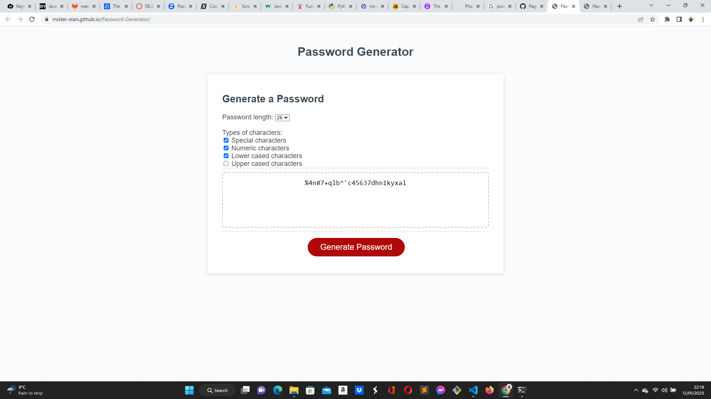

# password generator

## Website link: https://mister-stan.github.io/Password-Generator/

## 

## This is a website built using HTML, CSS and javaScript. The javaScript code generates a password that satisfies specific criteria selected by the user regarding the password length, use of special characters, numbers, lower case characters and upper case characters.

## Built with:HTML, CSS and javaScript

## Installation N/A

## Credits https://skillsforlife.edx.org/

## License MIT 
